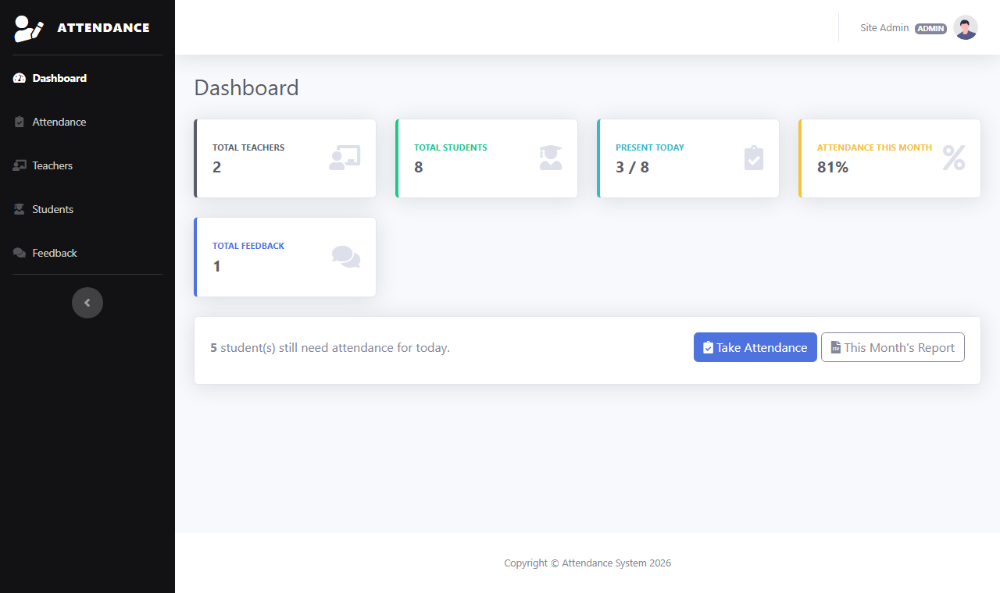
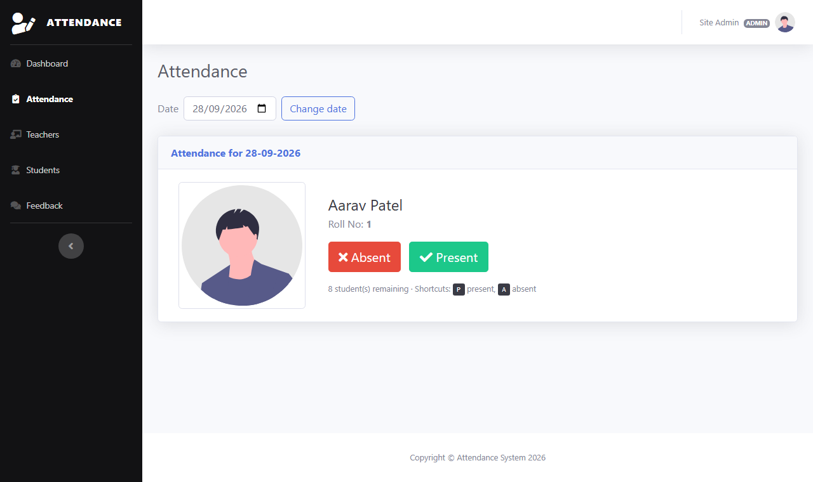
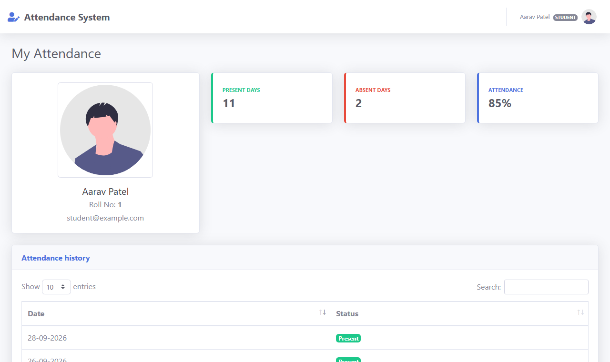
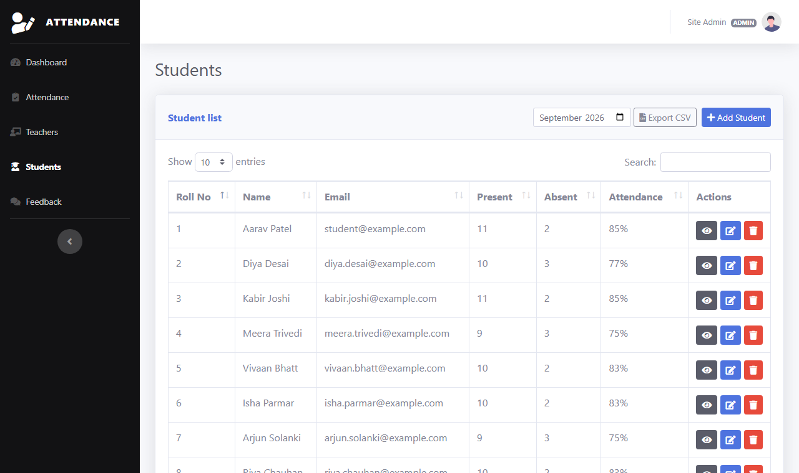
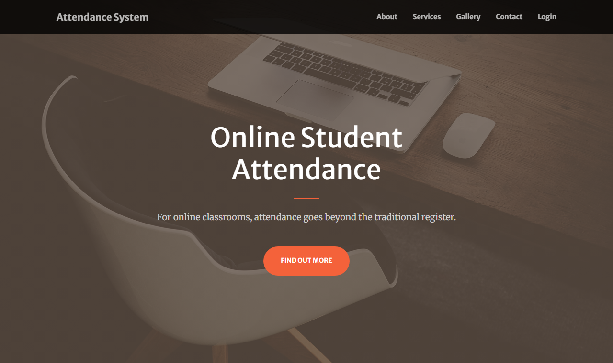

# Attendance System

A web-based student attendance management system built with **PHP** and **MySQL**.
Admins and teachers take daily attendance, manage students and teachers and read feedback.
Students log in to see their own attendance history.

Originally built as a BCA Semester 5 college project.



## Features

- **Role-based login** for admins, teachers and students
- **Quick attendance:** students appear one at a time; mark them present or absent with a click (or the <kbd>P</kbd> / <kbd>A</kbd> keys). Works for today or any past date, and each student can only be marked once per day.
- **Student management:** add, edit and delete students with an optional photo
- **Teacher management** (admin only)
- **Attendance history** per student with present/absent totals and attendance percentage; past records can be corrected
- **CSV export** of attendance for a month or for all time (opens in Excel)
- **Dashboard** with today's and this month's attendance at a glance
- **Public landing page** with a feedback form; feedback is listed in the admin panel
- Searchable, sortable tables (DataTables)

### Roles

| Feature                          | Admin | Teacher | Student |
|----------------------------------|:-----:|:-------:|:-------:|
| Dashboard                        |  ✅   |   ✅    |         |
| Take and correct attendance      |  ✅   |   ✅    |         |
| Add and edit students            |  ✅   |   ✅    |         |
| Delete students                  |  ✅   |         |         |
| Manage teachers                  |  ✅   |         |         |
| Read feedback                    |  ✅   |   ✅    |         |
| Delete feedback                  |  ✅   |         |         |
| Export attendance (CSV)          |  ✅   |   ✅    |         |
| View own attendance              |       |         |   ✅    |

## Screenshots

| Taking attendance | Student view |
|---|---|
|  |  |
| **Student list** | **Landing page** |
|  |  |

## Tech stack

- PHP 8 (plain PHP, no framework) with `mysqli` prepared statements
- MySQL 5.7+ / MariaDB 10.3+
- [SB Admin 2](https://startbootstrap.com/theme/sb-admin-2) (Bootstrap 4) for the admin panel
- [Start Bootstrap Creative](https://startbootstrap.com/theme/creative) (Bootstrap 5) for the landing page
- jQuery, DataTables, SweetAlert2, Toastr and Font Awesome

## Getting started

### Requirements

- PHP **8.0 or newer** with the `mysqli` extension
- MySQL or MariaDB
- The easiest option on Windows is [XAMPP](https://www.apachefriends.org/), which includes all of these.

### Installation (XAMPP)

1. **Download the project** into XAMPP's web root:
   ```bash
   cd C:\xampp\htdocs
   git clone https://github.com/deeprathod-fullstack/attendance-system.git
   ```
2. **Start Apache and MySQL** from the XAMPP Control Panel.
3. **Create the database.** Open <http://localhost/phpmyadmin>, go to **Import** and import
   [`database/schema.sql`](database/schema.sql). It creates the `attendance` database with all tables
   and a default admin account.
   Optionally, import [`database/seed.sql`](database/seed.sql) as well to get demo teachers, students and attendance.
4. **Configure (only if needed).** The defaults match a stock XAMPP install (`root` with no password).
   If your database settings are different, copy `config.example.php` to `config.php` and edit it.
5. Open <http://localhost/attendance-system/>.

You can also run it without Apache by using PHP's built-in server: `php -S localhost:8000`, then open <http://localhost:8000>.

### Default accounts

| Role    | Email                 | Password      | Available after      |
|---------|-----------------------|---------------|----------------------|
| Admin   | `admin@example.com`   | `admin123`    | `schema.sql`         |
| Teacher | `teacher@example.com` | `password123` | `seed.sql` (demo)    |
| Student | `student@example.com` | `password123` | `seed.sql` (demo)    |

> **Change the admin password** before using the app anywhere other than your own computer.
> There is no password page yet, so create a new hash with
> `php -r "echo password_hash('your-new-password', PASSWORD_DEFAULT);"` and paste it into the `admin` table in phpMyAdmin.

## Project structure

```
attendance-system/
├── index.php               Public landing page with the feedback form
├── login.php               Login form
├── login_submit.php        Login handler
├── feedback_submit.php     Feedback form handler
├── config.example.php      Configuration template (copy to config.php)
├── includes/               Shared PHP: bootstrap, database, auth, helpers
├── database/
│   ├── schema.sql          Tables and the default admin
│   └── seed.sql            Optional demo data
├── admin/                  Admin, teacher and student area
│   ├── include/            Layout (header/footer) and shared page parts
│   ├── assets/custom/      Project CSS and JavaScript
│   ├── assets/vendor/      Third-party libraries
│   └── upload/             Uploaded photos (not tracked by git)
├── library/                Landing and login page theme assets
└── docs/screenshots/       Images used in this README
```

## Security

- All SQL queries use prepared statements.
- Passwords are hashed with `password_hash()` (bcrypt).
- Every page and endpoint checks the user's role on the server.
- All forms and AJAX requests are protected with CSRF tokens.
- All output is escaped to prevent XSS.
- Uploads are checked to be real JPG/PNG/WEBP images (max 2 MB) and saved with random names. Script execution is disabled in the upload folder (Apache `.htaccess`).
- The session ID is regenerated on login, and session cookies are `HttpOnly` and `SameSite=Lax`.

This is a learning project. Review it carefully before using it in production.
In particular, add HTTPS and login rate limiting first.

## Roadmap

- [ ] Change-password and profile page for every role
- [ ] Monthly attendance charts on the dashboard
- [ ] Classes/divisions, so teachers only see their own students
- [ ] Login rate limiting
- [ ] Email notifications for low attendance

## Authors

- **Deep Rathod**
- **Devang Parekh**

## License

Released under the [MIT License](LICENSE).
The bundled themes and libraries (SB Admin 2, Start Bootstrap Creative, Bootstrap, jQuery, DataTables,
SweetAlert2, Toastr and Font Awesome Free) keep their own licenses.
